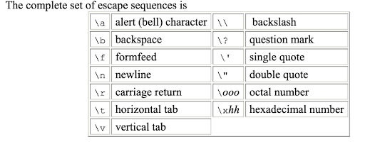
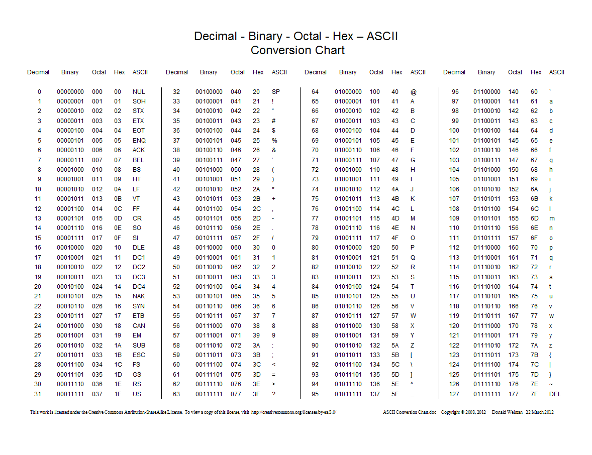
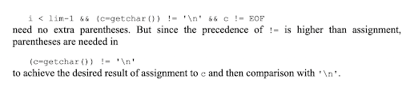

# lesson-2 notes

## Types, Variables, and Operations
```c
char a; // a single byte, capable of holding one character
int i; // an integer; max is based on machine
float f; // single-precision floating point number
double d; // double-precision floating point number
short int si; // decreases the size of an int; int can be omitted
long int li; // increase the size of an int; int can be omitted
```

VARIABLES - RESTRICTIONS
  - Begins with a letter
  - Consists of letters and numbers
  - The underscore "_" counts as a letter
  - Case sensitive
  - Use lower case for variable names & all caps for constants
  - Cannot use reserved keywords
  - ** Reccomended: When giving variable names, please provide good variable names.
  
CONSTANTS
  - Numbers are constants
```c
int a = 1234; // no suffix
long l = 123456789L; // suffix of l or L
// An integer constant too big to fit into an int will also be taken as a long. 

unsigned long ul = 123456789U; // suffix of u, U → unsigned constant; ul, UL → unsigned long
double d = 1.234; // number with decimal is default a double
float f = 1.234f; // suffix of f or F needed to indicate that it is not a double
long double ld = 1.234l; // suffix of l or L

// the value of an integer can be specified in octal or hexadecimal instead of decimal.
int octal = 037; // leading 0 on an integer means octal, so this is decimal 31
int hex = 0x1f // leading 0x or 0X means hexadecimal, so this is decimal 31
// octal and hexadecimal constants may also be followed by L to make them long and U to make // them unsigned:0XFUL is an unsigned long constant with value 15 decimal.
```

A character constant is an integer, written as one character within single quotes such as ‘x’. The value of a character constant is the numeric value of the character in the machine’s character set.

```c
int val = 'c';
char tab = '\t';
```

Certain characters can be represented in character and string constants by escape sequences like \n (newline); these sequences look like two characters, but represent only one.


***** Note for characters you must use single quotes. 


**Constant expression** - expression with only constants
**String constant (string literal)** - sequence of zero or more characters surrounded by double quotes. Technically, a string constant is an array of characters. The internal representation of a string has a null character ‘\0’ at the end, so the physical storage required is one more than the number of characters written in between the quotes.
‘x’ (integer used to produce the numeric value of the letter x) is not the same as “x” (array of characters that contains one character, the letter x, and a ‘\0’”.

The qualifier const can be applied to the declaration of any variable to specify that its value will not be changed. For an array the const qualifier says that the elements will not be altered. 
const double e = 2.71828;
Const char msg[] = “warning”;
int strlen(const char[]); //indicates that the function does not change that array.

automatic variable - local variable that is allocated and deallocated automatically when program flow enters and leaves the variable scope. Automatic variables for which there is no explicit initializer have undefined (garbage) values. External and static variables are initialized to 0 by default.

## More Constants
You can create constants with #define
```c
#include <stdio.h>
#define PI 3.14

void main()
{
    int radius = 2;
    float area = PI * radius * radius;
    printf("%f", area);
    return;
}
```

## Enums
You can create constants with enum
Enumeration constant - list of constant integer values. The first enum has value 0, the next 1, and so on, unless explicit values are specified. 
Such as: 
```c
enum months = {Jan = 1, FEB, MAR, APR} 
/* FEB = 2, Mar = 3, ..*/

#include <stdio.h>

enum daysOfTheWeek {
    SUN = 0,
    MON = 1,
    TUE = 2,
    WED = 3,
    THU = 4,
    FRI = 5,
    SAT = 6
};

void main()
{
    enum daysOfTheWeek day;
    day = MON;
    printf("%d", day);
    return;
}
```

Names do have to be distinct but values do not have to be distinct.

# OPERATIONS
  - Binary arithmetic operators are +, -, *, /, and the modulus operator %.
    - The % operator cannot be applied to a float or double.
    - Integer division truncates any fractional part. The direction of truncation for / and the sign of the result for % are machine-dependent for negative operands as is the action taken on overflow or underflow. 
  - PEMDAS
    - Parentheses ()
    - Exponents 2^x
    - Multiplication & Division *, /, %
    - Addition & Subtraction +, =

#### Operations Example
Convert 35°F to °C.
```c
#include <stdio.h>

/* Prints the conversion of a given Fahrenheit to Celsius */

void main()
{
    int fahr = 35;
    int celsius;
    celsius = 5 * (fahr-32) / 9;
    printf("%d\n", celsius);

    return;
}
```

# Type Conversions 
## Adding a Float and an Int
```c
#include <stdio.h>

int main()
{
    float f = 1.5f;
    int i = 3;
    int result = i + f;
    printf("%d", result);

    return 0;
}
```
Note that precision is lost if storing in an int.


## Adding a Float and an int
```c
#include <stdio.h>

int main()
{
    float f = 1.5f;
    int i = 3;
    float result = i + f;
    printf("%f", result);

    return 0;
}
```
Note that the int is implicitly convert to a float in the addition.


# Limits
```c
#include <stdio.h>
#include <limits.h>

int main()
{
    printf("CHAR_MIN: %d\n", CHAR_MIN);
    printf("CHAR_MAX: %d\n", CHAR_MAX);
    printf("SHRT_MIN: %d\n", SHRT_MIN);
    printf("SHRT_MAX: %d\n", SHRT_MAX);
    printf("INT_MIN: %d\n", INT_MIN);
    printf("INT_MAX: %d\n", INT_MAX);
    printf("UINT_MAX: %d\n", UINT_MAX);
    return 0;
}
```
https://www.cplusplus.com/reference/climits/ 

# Type Conversions 
   - When an operator has operands of different types, they are converted to a common type according to a small number of rule. In general the only automatic conversions are those that convert a narrower operand into a wider one without losing information such as converting an integer to a floating point in an expression like f + i. 
    - If there are no unsigned operands:
      - If either operand is long double, convert the other to long double.
      - Otherwise, if either operand is double, convert the other to double.
      - Otherwise, if either operand is float, convert the other to float.
      - Otherwise, convert char and short to int.
      - Then, if either operand is long, convert the other to long.
    - Note that floats in an expression are not automatically converted to double; this is a change from the original definition. The main reason for suing float is to save storage in large arrays, or less often, to save time on machines where double precision arithmetic is particularly expensive.
    - Conversion rules are more complicated when unsigned operands are involved. The problem is that comparisons between signed and unsigned values are machine-dependent, because they depend on the sizes of the various integer types. If int is 16 bits, and long is 32 bits, then -1L < 1U because 1U, an unsigned int, is promoted to a signed long. But -1L > 1UL because -1L is promoted to unsigned long and thus appears to be a large positive number.
  - Expressions that might lose information like assigning a longer integer type to a shorted, or a floating-point type to an integer may draw a warning, but are not illegal


Conversions take place across assignments, the value of the right side is converted to the type of the left, which is the type of the result. 

A character is converted to an integer, either by sign extension or not, as described above. 

Longer integers are converted to shorter ones or to chars by dropping the excess high-order bits. Thus in
```c
int i;
char c;

i = c;
c=i;
```
Type conversion also takes place when arguments are passed to functions. In the absence of a function prototype, char and short become int, and float becomes double. This is why we have declared function arguments to be int and double even when the function is called with char and float. If arguments are declared by a function prototype, as they normally should be, the declaration causes automatic coercion of any arguments when the function is called.

## WRAPPING
  - A char is just a small integer so chars may be freely used in arithmetic expressions. This permits considerable flexibility in certain kinds of character transformations. 
```c
#include <stdio.h>

int main()
{
    char c = 'C';
    printf("%c", c + 255);
    return 0;
}
```
** the language does not specify whether variables of type char are signed or unsigned quantities. When a char is converted to an int, depending on the machine, it can produce a negative integer. In some machines a char whose leftmost bit is 1 will be converted to a negative integer (sign extension) while on others a char is promoted to an int by adding zeros at the left end, and thus is always positive. 
The definition of C guarantees that any character in the machine’s standard printing character set will never be negative, but arbitrary patterns stored in character variables may appear to be negative on some machines, yet positive on others. For portability, specify signed or unsigned if non-character data is to be stored in char variables.




## Casting
  - This will force the expression to be the type you specified, but is not recommended as it is "hacky" as it can lead to unexpected behaviors.
 
Syntax: (type-name) expression
```c
#include <stdio.h>
#include <math.h>
#### Casting example
int main()
{
    float f = 4.5f;
    double result = sqrt(f);
    printf("%f\n", result);

    double castResult = sqrt((int) f);
    printf("%f\n", castResult);
    return 0;
}
```

https://www.tutorialspoint.com/format-specifiers-in-c Experiment with different casting examples.
```c
#include <stdio.h>

int main() {
    // Write C code here
    float c = 2.12321;
   
    printf("Hello world %.0f", c); 
/*this will print out none of the decimal places, where as 1, 2, 3.. Will print out some*/

    return 0;
}
```

# Relational & Logical Operators
## Relational & Equality Operators
Relational Operators:
  - \>  greater than
  - \>=  greater than or equal to
  - <  less than
  - <=  less than or equal to

Equality Operators:
  - ==  equal to; note that you use 2 = signs
  - !=  not equal to

The relational operators have higher precedence than the equality operators. Relational operators have lower precedence than arithmetic operators, so an expression like i < lim-1 is taken as i < (lim-1).

#### Relational Operators Example
```c
#include <stdio.h>
#include <stdbool.h>

int main()
{
    bool b = 5 < 2;
    printf("%d", b);

    return 0;
}
```
We generally don't print out bools like in the example above.

## Logical Operators:
  - &&  logical and
  - ||  logical or

These operators also result in a boolean (true or false). Evaluation stops as soon as the truth or falsehood of the result is known.

The precedence of && is higher than that of ||, and both are lower than relational and equality operators.


For numeric types, 0 is equivalent to false and any non-zero is true.
These are different from bitwise operations which we will learn later.

#### Logical Operators Example
```c
#include <stdio.h>
#include <stdbool.h>

int main()
{
    bool b = (true && false);
    printf("%d", b);

    return 0;
}
```

## The Unary Operator '!'
Negates the boolean
  - !0 -- true
  - !1 -- false
  - !100 -- false
  - !(5 < 2) -- true
  - !((5 < 2) || !(3 < 1)) -- false

We usually write: if (!valid) than if (valid ==0)


# HOMEWORK
  - Read The C Programming Language, 2nd Edition - Kerninghan & Ritchie, Chapter 2.1, 2.2, 2.3, 2.4, 2.5, 2.6, 2.7
  - Github Homework Assignment:
